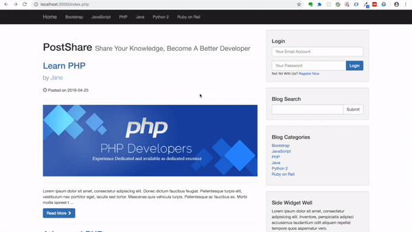
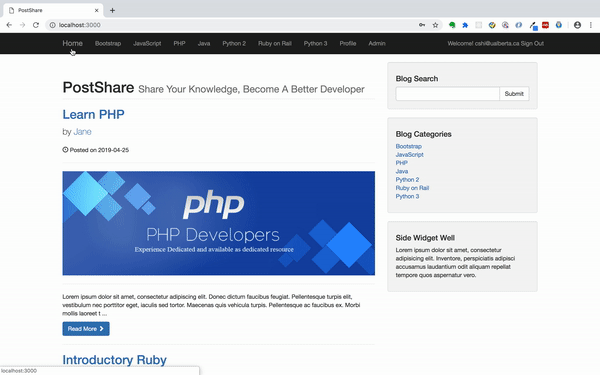
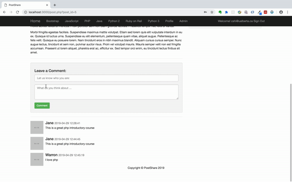

# PostShare
PostShare is a PHP Content Management System for Developer to share latest technologies. This App use PHP MySQL combination to achieve CRUD for Posts and User management.

## Features and Live Demo
* Admin user can login to the admin panel to view the statistics and break down of Posts, Comments can users info. Authentication is done by PHP Built in hashing algorithm. 


* Admin user can Add, Edit, Update and Delete Posts, Change users role and delete comments. Only Admin users have access to the admin panel.


* User can view the list of posts, request to view only a certain category of posts, or search for a specific posts.


* User can comment of a specific post and share something with the community


## Installation and Usage
1. Make sure you have PHP and MySQL installed in your computer
2. Clone repository to your local machine
3. Open Terminal, cd into the project directory
4. Seed database by running the following comment
```
mysql -u your_username -p your_password
source <path_for_your_project>/seed.sql
```
5. Start Server
```
php -S localhost:3000
```
